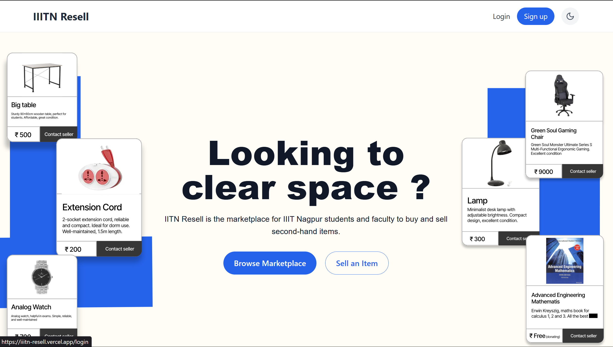

# IIITN-Resell



IIITN-Resell is a campus marketplace platform designed specifically for IIIT Nagpur students and faculty to buy and sell second-hand items. This full-stack application provides a secure, easy-to-use environment for the campus community to trade items, connect through real-time chat, and manage personal listings.

## Features

### User Management
- **Google OAuth Integration** - Secure login using institutional (@iiitn.ac.in) email addresses
- **JWT Authentication** - Secure API access with JSON Web Tokens
- **User Profiles** - Customizable profiles with image upload capabilities

### Product Listings
- **Intuitive Marketplace** - Browse all available products with advanced filtering
- **Category & Price Filtering** - Find items by category, price range, and more
- **Product Management** - Create, edit, and mark items as sold
- **Image Upload** - Add images to product listings using Cloudinary storage

### Messaging System
- **Real-time Chat** - Instant messaging between buyers and sellers
- **Product-Specific Conversations** - Chat about specific items
- **Notifications** - Get notified about new messages
- **Unread Message Tracking** - See which conversations have unread messages

### User Experience
- **Responsive Design** - Works on desktop and mobile devices
- **Dark/Light Mode** - Toggle between dark and light themes
- **Intuitive Navigation** - Easy-to-use interface with clear product visibility

## Technology Stack

### Frontend
- **React.js** - UI component library
- **React Router** - Client-side routing
- **Context API** - Global state management
- **Socket.io-client** - Real-time communication
- **Axios** - API request handling
- **Tailwind CSS** - Utility-first CSS framework
- **Lucide React** - Modern icon set

### Backend
- **Node.js** - JavaScript runtime
- **Express** - Web application framework
- **MongoDB** - NoSQL database
- **Mongoose** - MongoDB object modeling
- **Socket.io** - Real-time bidirectional communication
- **JWT** - Authentication mechanism
- **Passport.js** - Authentication middleware
- **Multer/Cloudinary** - File uploads and storage
- **bcryptjs** - Password hashing

## Getting Started

### Prerequisites
- Node.js (v14 or higher)
- MongoDB instance (local or Atlas)
- Cloudinary account for image storage
- Google OAuth credentials

### Environment Setup
1. Clone the repository:
```bash
git clone https://github.com/yourusername/iiitn-resell.git
cd iiitn-resell
```

2. Install dependencies:
```bash
# Install root dependencies
npm install

# Install server dependencies
cd server
npm install

# Install client dependencies
cd ../client
npm install
```

3. Create a `.env` file in the server directory with the following variables:
```
# Server Configuration
PORT=5000
NODE_ENV=development

# MongoDB Connection
MONGODB_URI=your_mongodb_connection_string

# JWT Secret
JWT_SECRET=your_jwt_secret_key
SESSION_SECRET=your_session_secret

# Google OAuth
GOOGLE_CLIENT_ID=your_google_client_id
GOOGLE_CLIENT_SECRET=your_google_client_secret

# Cloudinary Configuration
CLOUDINARY_CLOUD_NAME=your_cloud_name
CLOUDINARY_API_KEY=your_api_key
CLOUDINARY_API_SECRET=your_api_secret

# Client URL
CLIENT_URL=http://localhost:3000
PRODUCTION_CLIENT_URL=https://your-production-url.com
```

4. Create a `.env` file in the client directory:
```
REACT_APP_API_URL=http://localhost:5000/api
```

### Running the Application

#### Development Mode
```bash
# From the root directory
npm run dev
```
This will start both the client and server concurrently.

#### Production Build
```bash
# Build the client
cd client
npm run build

# Start the server (from root directory)
npm start
```

## API Endpoints

### Authentication
- `POST /api/auth/register` - Register a new user
- `POST /api/auth/login` - Login user
- `GET /api/auth/google` - Google OAuth login
- `GET /api/auth/profile` - Get user profile
- `GET /api/auth/verify-token` - Verify JWT token

### User Management
- `GET /api/users/profile` - Get current user profile
- `PUT /api/users/profile` - Update user profile
- `PUT /api/users/change-password` - Change user password
- `PUT /api/users/profile-picture` - Update profile picture

### Products
- `GET /api/products` - Get all products with filters
- `GET /api/products/user` - Get current user's products
- `GET /api/products/:id` - Get single product
- `POST /api/products` - Create a new product
- `PUT /api/products/:id` - Update a product
- `DELETE /api/products/:id` - Delete a product

### Chat
- `POST /api/chat/conversations` - Create a new conversation
- `GET /api/chat/conversations` - Get all user conversations
- `GET /api/chat/conversations/:conversationId/messages` - Get conversation messages

## Socket.io Events

### Client Events
- `join_conversation` - Join a conversation room
- `send_message` - Send a message
- `mark_as_read` - Mark messages as read
- `typing` - User is typing
- `stop_typing` - User stopped typing

### Server Events
- `receive_message` - Receive a new message
- `new_message_notification` - New message notification
- `messages_read` - Messages were read
- `user_typing` - User is typing
- `user_stop_typing` - User stopped typing

## Deployment

The application can be deployed to platforms like Heroku, Vercel, or DigitalOcean. Make sure to set up the environment variables appropriately for your production environment.

## Project Structure

```
iiitn-resell/
├── client/                 # React frontend
│   ├── public/             # Static files
│   └── src/                # Source code
│       ├── api/            # API service
│       ├── components/     # React components
│       ├── context/        # Context providers
│       ├── pages/          # Page components
│       └── config/         # Configuration
├── server/                 # Node.js backend
│   ├── middleware/         # Express middleware
│   ├── models/             # Mongoose models
│   ├── routes/             # API routes
│   └── server.js           # Server entry point
└── package.json            # Root package.json
```
## User Flow Diagram

![IIITN-Resell User Flow Diagram](https://mermaid.ink/img/pako:eNqFVl1zmzoQ_SsaOn0jCfjbdKYz_kyc2I5jt324OA8yCMwEUEaIuLkh__2uEGDhOLl96Fh79uyujnaXvGkOdYlmaV5ID84eM45-jbcxgn8De0kO6HdC2CO6uPiJhvYcx24Q-2iFffIoneT_37-jQcr3JOaBg3lAYzSFcBIbCnK2Jn6QcMIyNLLlbyYdlVij3HOTOg5JEi8NkeqYobE9p35QY8jYuRlwaRvntmtK_ZCge1FWhiZ2ca5XWUSZqHkzNLUXGNIsMHsi_DnETplNRp5EOAivVjhJDpS54H4ihMJDoBda4pfAPxVlmocaMnpICJpxEkHea3vFqJs6HI0JhxyJelNJGLgQDx5lDrLAQ2ToxhamkvfBf0Mwc_ZX0yDMpZ-q2BjqvJoH_p6jBbQA-kV9UOjEaQGKQNAEDVPOxSPM7Mr0IRuU4QUg8swRnre2aB1UGj94w6vRlGdoeKLfqQhCw1kM9WNHiJhIx-s8xojGHMxoQ8JQXPDOHu0xl-7e8eGk8xA7T4hT9YGq20qPiRvwMn-G5rZ6Vi8wl-LiF4IgXwxiwOup0AjHDgkrY3W3miILHEPICNpR4re1GoRLhha2es4f6lH1_hNANyxey4aAOpa2cgRhHKXRFznn97OLOTnmuFVBeR90bO97u_xd3BVNKYu-CIhWgcNTdgx8f1TrGPb2dGqUok-FWX7S-yqay1RBcxUak5BAeRW4sgsLdI8XsEhdBZIhOgRhUI-G7tXgBdoQ74RSD_aGY54m55irsiEFgGQGeA0JPtTAMkguZ-Vz3KSuXLKy74p-vyl21C5SW3SqgmXTfVhI-cCKkJtXWMGRBGbFggihQ8R9XghLikW7ttUzKge-uOhdQYSxLBCYOwmtz0BrFSpHUI0PPTs7qRj2JBZvhfJplqtHXR3n8Axt7Lr9_Bb4hCtdNp-LUvMYhTTJZ1--QVX4hr_CALjEC-JAWVZOCH0_Jh6KxIcFhiS0vjV3vYbX0eHzRp-I9c10W8Tt6Q4NKbMO-4CTHydcDJ-ugtvatdudZsVtdltm2_yK-1zsMEk3jV2_Z1Z0o93vdPr_Q88nW9J7u7ajVN51mpi4X9EdobTkeu0-MXYV1-13u0bnDPc4DEkS-LGMBd8c6J0YdqCqK5rq17mwalo00If6SB_rk1y3GnSjz_WlvtIfSllq6K2-0O_LG9eQmX6nr_VNfp0fmq75LHA1i7OU6FpEYBuIo_YmKFsN_syIyFaz4KcL22SrbeN34Dzj-B9Ko5LGaOrvNcvDYQKnNN-j4wD7DEeVlcE4ETaiacw1y2yZeRDNetP-ataF2elcmh3DbBhGt9E3ekZT117B3r2Enmi12-1Gr9NvdrvNd137N0_cuGx2jb7RaPZbvZ7RaLz_B9AvL10)

## Future Enhancements

- **Admin Dashboard** - For content moderation and user management
- **Advanced Search** - Full-text search capabilities
- **Recommendation System** - Personalized product recommendations
- **Wishlist Feature** - Save favorite products
- **In-app Notifications** - Broader notification system
- **Report System** - Allow users to report inappropriate listings
- **Mobile App** - Native mobile application

## Contributing

1. Fork the repository
2. Create your feature branch (`git checkout -b feature/amazing-feature`)
3. Commit your changes (`git commit -m 'Add some amazing feature'`)
4. Push to the branch (`git push origin feature/amazing-feature`)
5. Open a Pull Request

## License

This project is licensed under the ISC License.

## Acknowledgments

- IIIT Nagpur for supporting campus entrepreneurship
- Open source community for the amazing tools and libraries