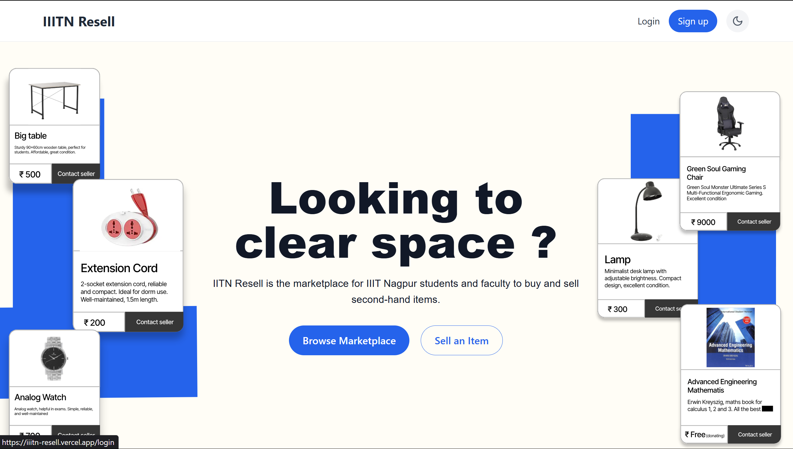

# IIITN-Resell — Java Spring Boot Microservices Platform



A campus marketplace for IIIT Nagpur, built as a distributed, event-driven
backend on the JVM. The frontend is React. The backend is
**10 Spring Boot 3 / Java 21 services** orchestrated with service discovery,
centralized configuration, an API gateway, two distinct messaging substrates
(Apache Kafka + RabbitMQ), Redis caching, Elasticsearch search, and a
Postgres-based star-schema data warehouse.

---

## Architecture at a glance

```
                                  React (CRA / Tailwind)
                                         │
                                         ▼  HTTP + Socket.IO
                              ┌────────────────────────┐
                              │   Spring Cloud Gateway │  ◄── Redis (rate-limit)
                              │     (JWT validation)   │
                              └─────────────┬──────────┘
                                            │
   ┌───────────────┬──────────────┬─────────┴────────┬──────────────┬─────────────┐
   ▼               ▼              ▼                  ▼              ▼             ▼
auth-svc      user-svc       product-svc         chat-svc      search-svc   analytics-svc
 (8081)        (8082)          (8083)            (8084 +         (8086)        (8087)
                                                  9092 ws)
   │             │ ▲             │  ▲              │   │            ▲             ▲
   │             │ │             │  │              │   │            │             │
   │             │ │ Redis       │  │ Redis        │   │  Rabbit    │             │
   │             │ │ cache       │  │ cache        │   ▼  queue     │             │
   │             │ │             │  │           notification-svc    │             │
   │             ▼ │             ▼  │              (8085)           │             │
   │           Postgres        Postgres              │              │             │
   │          (user_db)      (product_db)            ▼              │             │
   │                                              Postgres          │             │
   │                                          (notification_db)     │             │
   │                                                                │             │
   ▼                                                                │             │
Postgres (auth_db)                                                  │             │
                                                                    │             │
   ─────────────────── Kafka (event bus) ───────────────────────────┘             │
        topics: user.events.v1 · product.events.v1 · chat.events.v1               │
                                                                                  ▼
                                            Elasticsearch              Postgres-warehouse
                                                                       (star schema, OLAP)

         Cross-cutting:  Eureka (discovery) · Spring Cloud Config (config-repo)
```

---

## Services

| Service              | Port  | Storage              | Purpose                                                            |
| -------------------- | ----- | -------------------- | ------------------------------------------------------------------ |
| `discovery-server`   | 8761  | —                    | Netflix Eureka registry                                            |
| `config-server`      | 8888  | local config repo    | Spring Cloud Config (native, file-backed)                          |
| `api-gateway`        | 8080  | Redis                | Spring Cloud Gateway · JWT validation · rate-limit · CORS          |
| `auth-service`       | 8081  | Postgres `auth_db`   | Register/login · BCrypt · Google OAuth2 · JWT issuance             |
| `user-service`       | 8082  | Postgres + Redis     | User profiles · profile-pic upload (Cloudinary) · Kafka mirror     |
| `product-service`    | 8083  | Postgres + Redis     | Listings CRUD · Cloudinary uploads · publishes Kafka domain events |
| `chat-service`       | 8084 + 9092 (ws) | Postgres + Redis + RabbitMQ | REST conversations · Socket.IO (wire-compat) · Kafka + Rabbit publish |
| `notification-service` | 8085 | Postgres            | Consumes RabbitMQ work queue + Kafka SOLD events → persists notifications |
| `search-service`     | 8086  | Elasticsearch        | Consumes `product.events.v1` → indexes → faceted full-text search  |
| `analytics-service`  | 8087  | Postgres warehouse   | Consumes every Kafka topic → upserts star-schema facts/dimensions  |

---

## Tech stack — what every line on the resume bullet maps to

| Resume bullet | Where in code |
| ------------- | ------------- |
| Spring Boot 3.3 / Java 21 / Maven multi-module | [pom.xml](pom.xml) |
| Microservices with service discovery (Eureka) | [discovery-server/](discovery-server/) |
| Centralized config (Spring Cloud Config) | [config-server/](config-server/) + [config-repo/](config-server/src/main/resources/config-repo/) |
| API Gateway with JWT auth + Redis rate-limiting | [JwtAuthGatewayFilter.java](api-gateway/src/main/java/com/iiitn/resell/gateway/security/JwtAuthGatewayFilter.java) |
| Database-per-service pattern | Each service has its own Flyway-managed Postgres DB |
| OAuth2 Authorization-Code flow (Google) | [GoogleOAuthService.java](auth-service/src/main/java/com/iiitn/resell/auth/service/GoogleOAuthService.java) |
| JWT issuance + cross-service verification | [JwtTokenProvider.java](common/src/main/java/com/iiitn/resell/common/security/JwtTokenProvider.java) |
| **Apache Kafka** event bus (product/user/chat events) | [ProductService publishes](product-service/src/main/java/com/iiitn/resell/product/service/ProductService.java) · [search-service indexes](search-service/src/main/java/com/iiitn/resell/search/kafka/ProductIndexer.java) · [analytics-service warehouses](analytics-service/src/main/java/com/iiitn/resell/analytics/kafka/AnalyticsConsumers.java) |
| **RabbitMQ** work queue with DLX/DLQ retry policy | [chat publishes](chat-service/src/main/java/com/iiitn/resell/chat/config/RabbitConfig.java) · [notification consumes](notification-service/src/main/java/com/iiitn/resell/notification/rabbit/RabbitConsumer.java) |
| Redis caching with Jackson serializer | [product RedisCacheConfig](product-service/src/main/java/com/iiitn/resell/product/config/RedisCacheConfig.java) |
| Elasticsearch full-text + faceted search | [SearchController.java](search-service/src/main/java/com/iiitn/resell/search/api/SearchController.java) |
| Data warehouse (star schema) | [infrastructure/warehouse-init/01-star-schema.sql](infrastructure/warehouse-init/01-star-schema.sql) + [WarehouseWriter.java](analytics-service/src/main/java/com/iiitn/resell/analytics/warehouse/WarehouseWriter.java) |
| Circuit Breaker (Resilience4j) | [CloudinaryService.java](product-service/src/main/java/com/iiitn/resell/product/service/CloudinaryService.java) |
| Real-time WebSocket chat (Socket.IO wire-compatible) | [ChatSocketHandler.java](chat-service/src/main/java/com/iiitn/resell/chat/socket/ChatSocketHandler.java) |
| Database migrations (Flyway) | `*/src/main/resources/db/migration/V1__*.sql` |
| Domain events / CQRS read-model | `product-service` writes Postgres → publishes → `search-service` builds ES read model |
| Docker Compose for full local stack | [docker-compose.yml](docker-compose.yml) |
| Health, metrics, Prometheus (Actuator + Micrometer) | enabled in every service via `config-repo/application.yml` |
| Structured exception handling | [GlobalExceptionHandler.java](common/src/main/java/com/iiitn/resell/common/exception/GlobalExceptionHandler.java) |
| OpenAPI / Swagger UI per service | `springdoc-openapi-starter-webmvc-ui` |

### Why both Kafka *and* RabbitMQ?

A common interview question. The split is deliberate:

- **Kafka** carries durable **domain events** (`product.events.v1`,
  `chat.events.v1`, `user.events.v1`). Many consumers replay the same log
  for different read-models: search indexes, warehouse facts, notifications
  about sold items. Pub/sub, retention, replay.
- **RabbitMQ** carries **per-recipient task work** (`notification.dispatch`).
  Each message has exactly one consumer; failures dead-letter to a DLQ
  with retry policy. Work-queue semantics, ack/nack, low latency.

Using the right tool for each pattern is the point — not unifying them.

---

## Running it locally

You need: **Docker**, **Java 21** (`sdk install java 21-tem`), **Maven 3.9+**,
**Node 18+** (for the React client).

### 1. Start the backing infrastructure

```bash
cp .env.example .env   # fill in Cloudinary + Google OAuth creds
docker compose up -d
```

This brings up Postgres (OLTP), a separate Postgres (warehouse), Redis,
Zookeeper, Kafka, RabbitMQ, Elasticsearch, and Kibana. Wait ~30s for
healthchecks to go green.

### 2. Build all services

```bash
mvn -T 1C clean package -DskipTests
```

### 3. Launch the services

Open one terminal per service (or use a process manager / IDE run configs).
Order matters only for the first two — discovery and config must be up
before the others register.

```bash
# 1. Discovery + Config first
(cd discovery-server     && mvn spring-boot:run)
(cd config-server        && mvn spring-boot:run)

# 2. Then everything else (any order)
(cd api-gateway          && mvn spring-boot:run)
(cd auth-service         && mvn spring-boot:run)
(cd user-service         && mvn spring-boot:run)
(cd product-service      && mvn spring-boot:run)
(cd chat-service         && mvn spring-boot:run)
(cd notification-service && mvn spring-boot:run)
(cd search-service       && mvn spring-boot:run)
(cd analytics-service    && mvn spring-boot:run)
```

Eureka dashboard: <http://localhost:8761>
Kibana:           <http://localhost:5601>
RabbitMQ admin:   <http://localhost:15672>  (user/pass from `.env`)

### 4. Start the React client

```bash
cd client
npm install
npm start
```

It points at the gateway at `http://localhost:8080/api`. Socket.IO chat
connects to `http://localhost:9092`.

---

## Project layout

```
IIITN-Resell/
├── client/                     # React frontend
├── pom.xml                     # Maven parent (Spring Boot 3.3, Spring Cloud 2023.0)
├── docker-compose.yml          # Postgres x2, Redis, Kafka, RabbitMQ, ES, Kibana
├── .env.example
├── common/                     # Shared library: JWT, events, DTOs, exceptions
├── discovery-server/           # Eureka
├── config-server/              # Spring Cloud Config (native file backend)
├── api-gateway/                # Spring Cloud Gateway (reactive)
├── auth-service/               # Local auth + Google OAuth → JWT
├── user-service/               # Profiles (Postgres + Redis cache)
├── product-service/            # Listings + Cloudinary + Kafka publish
├── chat-service/               # REST + Socket.IO + Rabbit + Kafka
├── notification-service/       # Rabbit consumer + Kafka SOLD consumer
├── search-service/             # ES indexer + faceted search API
├── analytics-service/          # Kafka → star-schema warehouse + reports
├── infrastructure/
│   ├── postgres-init/          # Create per-service databases on first boot
│   └── warehouse-init/         # Star schema: dim_* / fact_*
└── README.md
```

Every service module sits at the repo root — a single `pom.xml` aggregates
them as Maven sub-modules. Run `mvn package` from the root and every
service builds in parallel.

---

## Notable design choices

- **Single physical Postgres, many logical databases.** Database-per-service
  pattern preserved; one Postgres container keeps the local stack light.
- **Gateway is the only JWT validator.** Downstream services trust
  `X-User-Id` / `X-User-Email` / `X-User-Admin` headers because the gateway
  strips any external version before re-injecting verified ones.
- **Event schemas versioned in the topic name** (`product.events.v1`)
  so a v2 schema can co-exist during migration.
- **Star-schema warehouse seeded with a 10-year `dim_date`** so every fact
  insert can join even without first running an ETL job.
- **Socket.IO via `netty-socketio`** rather than STOMP — keeps the existing
  React `socket.io-client` working without frontend refactor.
- **No co-located OAuth2 client lib in auth-service.** Hand-rolled
  authorization-code flow against Google for clarity and full control of
  the post-login redirect into the React `/auth-success` page.

---

## Frontend

The React client is the original Tailwind + React Router app. The only
environment-aware bits:

- `client/src/api/api.js` — base URL points at the gateway (`:8080/api`).
- `client/src/config/api.js` — same.
- `client/src/context/ChatContext.js` — Socket.IO connection points at the
  chat-service's dedicated socket port (`:9092`) and passes the JWT in the
  query string so the Java handler can read it.

Override at deploy time with `REACT_APP_API_URL` and `REACT_APP_SOCKET_URL`.

---

## What's intentionally not built (yet)

- Image storage is **Cloudinary** (a remote SaaS); a self-hosted MinIO
  swap-in is a one-class change in `CloudinaryService`.
- Tests are scaffolded by Spring Boot defaults; Testcontainers-based
  integration tests are wired in `pom.xml` but suites aren't filled in.
- No CI pipeline (GitHub Actions config is straightforward — `mvn verify`
  per module + a `docker buildx` matrix).
- The 3 facts (`fact_listing`, `fact_sale`, `fact_message`) are the ones
  the running services emit; richer dimensions (UTM, device, geo) would
  normally come from a frontend telemetry pipeline.

---

## License

ISC.
